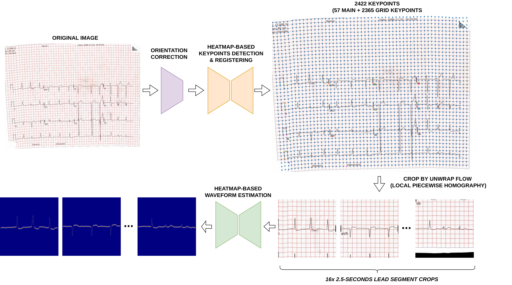

5th place solution of the [PhysioNet - Digitization of ECG Images](https://www.kaggle.com/competitions/physionet-ecg-image-digitization) competition on Kaggle

**Solution writeup**: [5th place solution: Multi-stages Heatmap-based Modeling](https://www.kaggle.com/competitions/physionet-ecg-image-digitization/writeups/5th-place-solution)


## Changelogs
**2025/02/06**: extensive ablation study was added, checkout [docs/ABLATION_STUDY.md](docs/ABLATION_STUDY.md)


## Table Of Contents
- [Changelogs](#changelogs)
- [Table Of Contents](#table-of-contents)
- [Solution Summary](#solution-summary)
- [Hardware](#hardware)
- [Installation](#installation)
- [Data Setup](#data-setup)
- [Winning Solution Reproducing](#winning-solution-reproducing)
  - [Important Notes](#important-notes)
  - [Image Rotation model training](#image-rotation-model-training)
  - [Keypoints Detection models training](#keypoints-detection-models-training)
    - [(1) Training 5-folds Stage 1 Heatmap models (round 2)](#1-training-5-folds-stage-1-heatmap-models-round-2)
    - [(2) Finetune 5-folds Stage 2 DSNT models (round 2)](#2-finetune-5-folds-stage-2-dsnt-models-round-2)
  - [Waveform Estimation models training](#waveform-estimation-models-training)
    - [(1) Dual Encoder CoaT Lite Medium + VGG19 on image size 1024x1024 (main model)](#1-dual-encoder-coat-lite-medium--vgg19-on-image-size-1024x1024-main-model)
    - [(2) Dual Encoder ConvNeXT Large + VGG19 on image size 1024x1024 (main model)](#2-dual-encoder-convnext-large--vgg19-on-image-size-1024x1024-main-model)
    - [(3) Single Encoder ConvNeXT-small on image size 1024x512 (TALL model)](#3-single-encoder-convnext-small-on-image-size-1024x512-tall-model)
- [Ablation Study](#ablation-study)
- [More experiments](#more-experiments)
- [Resources](#resources)
- [Acknowledgements](#acknowledgements)


## Solution Summary



- **Orientation Correction**: train a simple EfficientVIT-B2 (image size 512) model to jointly predict one of 4 possible rotations 0/90/180/270 degrees (classification task) and the exact rotation angle encoded by sine/cosine (regression task)
- **UNet2D for Keypoints Detection**:
  - Use one of the SOTA opensource dense matching model [MINIMA-RoMa](https://github.com/LSXI7/MINIMA) to obtain very accurate initial pseudo-labeled keypoints. This involved simply matching the type 0001 image to each image in the training set.
  - UNet2D model with ConvNeXT-small encoder, operate on high resolution of `2048x2048` to predict the 58-channels heatmap-encoding of 2422 keypoints (57 main feature-rich keypoints + 43*55=2365  grid keypoints)
  - Iterative Pseudo Labeling as denoising process on init pseudo label got from MINIMA-RoMa (2 rounds in total)
  - Keypoints registering: an iterative algorithm based on Hungarian Matching between current image's coordinate system and the Reference coordinate system (image type `0001`)
- **UNet2D for Waveform Estimation**:
  - Per-lead cropping using Local Piecewise Homography Warping
  - Columnwise 1D-Gaussian heatmap encoding, a "nearly lossless" codec
  - Use high resolution image (1024x1024)
  - Dual Encoder with a coarse encoder (either CoaT-Lite-Medium or ConvNeXT-Large) and a fine encoder (first 17 blocks of VGG19)


---

## Hardware
Different machines equipped with different GPUs (NVIDIA L40S or A30) were used. However, all experiments can be conducted using a single [NVIDIA L40S 48GB GPU](https://resources.nvidia.com/en-us-l40s/l40s-datasheet-28413?ncid=no-ncid).
Different models require different hardware requirements, but minimum requirements to train **ALL** models are:
- NVIDIA Driver: >= 535.x (recommended 570.86.15)
- GPU: >=45 GB VRAM, recommended NVIDIA L40S
- CPU: >= 8 cores
- RAM: >=48 GB
- Disk: >= 100 GB
- OS: Ubuntu with Docker installed
- Dependencies: see [docker/Dockerfile](docker/Dockerfile)


## Installation
Recommended to use Docker to setup local environment, detailed in [docker/Dockerfile](docker/Dockerfile).
```bash
# build new Docker image given Dockerfile
cd ${THIS_REPO_ROOT_DIR}/docker
docker build -t pytorch:2.6.0-cuda12.6-cudnn9-devel .
# create/run new Docker container named `kaggle_ecg`
# modify suited for your local environment setup
docker run --name kaggle_ecg -v ${THIS_REPO_ROOT_DIR}:/workspace/projects/ecg/ --gpus '"device=all"' --ipc=host --network=host --privileged --ulimit stack=-1 --ulimit memlock=-1 --shm-size=1T -td pytorch:2.6.0-cuda12.6-cudnn9-devel zsh
# exec to running command inside created container
docker exec -it kaggle_ecg zsh
```

**From now, ensure that all following commands are invoked inside the newly created Docker container.**  


## Data Setup

Put all data (both [raw competition data](https://www.kaggle.com/competitions/physionet-ecg-image-digitization/data) and [processed data](https://www.kaggle.com/datasets/dangnh0611/ecg-digitization-processed-data/)) to `./data` relative to this repo's root directory, e.g `/workspace/projects/ecg/data/`.Restructure so that data directory looks like (outputs of `tree -L 2 ./data`):
```
❯ tree -L 2 ./data
./data
|-- processed
|   |-- REFERENCE_TEMPLATE_FS100.png
|   |-- cv
|   |-- imc_results.json
|   |-- keypoints_by_homo.csv
|   |-- keypoints_by_homo.npy
|   |-- keypoints_by_model.csv
|   |-- keypoints_by_model.npy
|   |-- keypoints_by_round1.csv
|   |-- keypoints_by_round1.npy
|   |-- keypoints_by_round2.csv
|   |-- keypoints_by_round2.npy
|   |-- pseudo_label
|   |-- pseudo_test
|   |-- reference_keypoints.json
|   `-- templates
`-- raw
    |-- sample_submission.parquet
    |-- test
    |-- test.csv
    |-- train
    `-- train.csv

9 directories, 14 files
```


**Step-by-step details**:
- Download the [official competition data](https://www.kaggle.com/competitions/physionet-ecg-image-digitization/data) and put to [./data/raw/](./data/raw)
- Download the processed data from [my Kaggle dataset](https://www.kaggle.com/datasets/dangnh0611/ecg-digitization-processed-data): More details and explainations about how each part/file was generated are listed under [docs/DATA_PROCESSING.md](docs/DATA_PROCESSING.md)


## Winning Solution Reproducing

All submissions include the 
The final winning submission:
* Single Image Rotation/Orientation model of EfficientVIT-B2, image size `512x512`
* 5-folds UNet Keypoint Detection models with ConvNeXT-small encoder, image size `2048x2048`
* Ensemble of 2 Waveform Estimation models, both with Dual Encoder with corresponding weights of 0.7-0.3:
  * (1) CoaT Lite Medium + VGG19 on image size `[1024, 1024]`, output heatmap of size `[1024, 1024]` (*first time training, no validation*).
  * (2) ConvNeXT Large + VGG19 on image size `[1024, 1024]`, output heatmap of size `[1024, 1024]` (*first time training, no validation*).
* A "TALL" Waveform model (single encoder ConvNeXT-small) accepting an input size of `[1024, 512]` and able to handle waveforms in the range `[-6.4, 6.4]` to solve the limited range of the main models, acting as a refinement stage where the first stage's predictions were near the limitation, e.g., `np.abs(prediction_signal)` close to `3.2`.

|                                          **MODEL**                                          | **SNR on train set** |  **Public LB** | **Private LB** |
|:-------------------------------------------------------------------------------------------:|:--------------------:|:--------------:|:--------------:|
| Dual Encoder CoaT Lite Medium + VGG19, image size 1024, heatmap size 1024                   |       **28.006985**      |  **22.63859**  |  **22.34824**  |
| Dual Encoder ConvNeXT Large + VGG19, image size 1024, heatmap size 1024                     |      27.484089       |    22.43810    |    22.15886    |
| Ensemble (1) and (2) with weight 0.7-0.3, lead fusion, refinement using TALL model 1024x512 |         _N/A_        | **_22.93061_** | **_22.62929_** |

### Important Notes
Before running any commands, make sure to go to the projects root directory and export some environment variables:
```bash
cd ${THIS_REPO_ROOT_DIR}
export PYTHONPATH=$(pwd)/src/:$(pwd)/yagm/src/:$PYTHONPATH
# use 1 GPU for training, you should change this suited for your local environment
export CUDA_VISIBLE_DEVICES='0'
```

From now, all training commands below are all executed on the current repo's root directory, e.g `/workspace/projects/ecg/`


### Image Rotation model training

**Training command**
```bash
python3 -m yagm.run -m local=local 'cv.fold_idx=0' cv.train_on=all cv.val_on=all exp_name=EFFVIT_B2_512 exp=image_rotation_exp optim.lr=5e-5 loader.train_batch_size=64 trainer.accumulate_grad_batches=2 'loggers=[csv,wandb]' model.encoder.pretrained=True loader.train_num_workers=32 trainer.max_steps=12100 trainer.val_check_interval=4000 scheduler.warmup_steps=1000 trainer.compile.mode=null
```

should produce the following metrics:
| **fold** | **val/accuracy**           | **val/angle_mae**          | **val/sine_cosine_mae**    | **val/loss**              |
|----------|----------------------------|----------------------------|----------------------------|---------------------------|
|        0 | 1.000000 (ema_0.995 12.0K) | 1.103764 (ema_0.995 12.0K) | 0.011259 (ema_0.995 12.0K) | 0.011170 (ema_0.995 8.0K) |

**Reference training logs**: https://drive.google.com/drive/folders/1hHOMdX0TwDU9_LYP4nUcF4bmYDMTOqRF?usp=drive_link

### Keypoints Detection models training

#### (1) Training 5-folds Stage 1 Heatmap models (round 2)

**Training command:**
```bash
python3 -m yagm.run -m exp=REPRODUCE_KEYPOINT_DETECTION_ROUND2_STAGE1_HEATMAP
```
or equivalent to (original version - more explicit):
```bash
python3 -m yagm.run -m local=local 'cv.fold_idx=null' exp_name=ROUND2_CONVNEXT_2048_GLS_ALLFOLDS exp=keypoint_detection_exp optim.lr=1e-4 scheduler.min_lr_factor=1e-3 loader.train_batch_size=1 trainer.accumulate_grad_batches=8 'loggers=[csv,wandb]' loader.train_num_workers=16 loader.val_num_workers=16 callbacks.model_checkpoint.save_top_k=1 trainer.compile.mode=model 'loss.mtl.loss_weights=[1,0,0,1]' loss.mtl.weight_method=gls loss.main.heatmap_loss=jsd data.main_sigma=2 'data.heatmap_stride=[1,1]' model/encoder=convnext model.decoder.n_blocks=4 'model.decoder.decoder_channels=[-1,384,256,128,64]' model/decoder=smp 'data.img_size=[2048,2048]' 'ema.train_decays=[0.999]' data.gt_name=keypoints_by_round1 trainer.max_steps=15000 'callbacks.validation_scheduler.milestones=[10000]' 'callbacks.validation_scheduler.val_check_intervals=[1000]'
```

shoud produce the following metrics:
| **fold** | **val/best__AVG_ACC**      | **val/best__ACC**          | **val/GRID_AP**            |
|----------|----------------------------|----------------------------|----------------------------|
|        0 | 0.999484 (ema_0.999 14.0K) | 0.999622 (ema_0.999 14.0K) | 0.997399 (ema_0.999 14.0K) |
|        1 | 0.999165 (ema_0.999 14.0K) | 0.999324 (ema_0.999 14.0K) | 0.997957 (ema_0.999 14.0K) |
|        2 | 0.999309 (ema_0.999 10.0K) | 0.999570 (ema_0.999 14.0K) | 0.996768 (ema_0.999 13.0K) |
|        3 | 0.999208 (ema_0.999 13.0K) | 0.999470 (ema_0.999 10.0K) | 0.997109 (ema_0.999 14.0K) |
|        4 | 0.999577 (ema_0.999 14.0K) | 0.999680 (ema_0.999 14.0K) | 0.997651 (ema_0.999 13.0K) |


**Reference training logs**: https://drive.google.com/drive/folders/1w4BjjaIeXyTYsRunqr2_MoI0j3mNMk88?usp=drive_link


#### (2) Finetune 5-folds Stage 2 DSNT models (round 2)
**Training command:**
```bash
python3 -m yagm.run -m exp=REPRODUCE_KEYPOINT_DETECTION_ROUND2_STAGE2_DSNT ckpt.name=best_val_best__AVG_ACC.ckpt ckpt.path={PATH_TO_YOUR_STAGE1_OUTPUT_DIR}
```

for example:
```
python3 -m yagm.run -m exp=REPRODUCE_KEYPOINT_DETECTION_ROUND2_STAGE2_DSNT ckpt.name=best_val_best__AVG_ACC.ckpt ckpt.path=./outputs/KEYPOINTS_DETECTION_MODELS/pseudo_label_round2_heatmap/
```

Or, equivalent to (original version - more explicit):
```bash
python3 -m yagm.run -m local=local 'cv.fold_idx=null' exp_name=ROUND2_CONVNEXT_2048_GLS_ALLFOLDS_FINETUNE_DSNT exp=keypoint_detection_exp optim.lr=1e-5 scheduler.min_lr_factor=1e-2 loader.train_batch_size=1 trainer.accumulate_grad_batches=8 'loggers=[csv,wandb]' loader.train_num_workers=16 loader.val_num_workers=16 callbacks.model_checkpoint.save_top_k=1 trainer.compile.mode=model 'loss.mtl.loss_weights=[1,1,0,1]' loss.mtl.weight_method=gls loss.main.heatmap_loss=jsd data.main_sigma=2 'data.heatmap_stride=[1,1]' model/encoder=convnext model.decoder.n_blocks=4 'model.decoder.decoder_channels=[-1,384,256,128,64]' model/decoder=smp 'data.img_size=[2048,2048]' 'ema.train_decays=[0.999]' data.gt_name=keypoints_by_round1 trainer.max_steps=5000 trainer.val_check_interval=1000 ckpt.name=best_val_best__AVG_ACC.ckpt ckpt.path=./outputs/KEYPOINTS_DETECTION_MODELS/pseudo_label_round2_heatmap/
```

should produce the following metrics:

| **fold** | **val/best__AVG_ACC**     | **val/best__ACC**         | **val/GRID_AP**           |
|----------|---------------------------|---------------------------|---------------------------|
|        0 | 0.999509 (ema_0.999 2.0K) | 0.999612 (ema_0.999 4.0K) | 0.997284 (ema_0.999 1.0K) |
|        1 | 0.999206 (ema_0.999 4.0K) | 0.999314 (ema_0.999 2.0K) | 0.997934 (ema_0.999 1.0K) |
|        2 | 0.999356 (ema_0.999 2.0K) | 0.999580 (ema_0.999 4.0K) | 0.996499 (ema_0.999 3.0K) |
|        3 | 0.999238 (ema_0.999 2.0K) | 0.999470 (ema_0.999 3.0K) | 0.997053 (ema_0.999 1.0K) |
|        4 | 0.999585 (ema_0.999 3.0K) | 0.999680 (ema_0.999 4.0K) | 0.997656 (ema_0.999 2.0K) |


**Reference training logs**: https://drive.google.com/drive/folders/188JwpS2wdz8XopRJmefS9B0RAQXGWrwS?usp=drive_link


### Waveform Estimation models training

#### (1) Dual Encoder CoaT Lite Medium + VGG19 on image size 1024x1024 (main model)

**Training command:**
```bash
python3 -m yagm.run -m local=local 'cv.fold_idx=0' cv.train_on=all cv.val_on=val exp_name=ALLDATA_FINAL_COAT512_VGG1024_GT1000_LR2en4_SEED980611 exp=final_fine_coat512_vgg1024_gt1000 optim.lr=2e-4 scheduler.min_lr_factor=5e-4 loader.train_batch_size=4 trainer.accumulate_grad_batches=2 loader.train_num_workers=32 'loggers=[csv,wandb]' trainer.compile.mode=model seed=980611
```

**Reference training logs**: https://drive.google.com/drive/folders/1u_hxB_HKBNIcB6QOn9ySONz-PTL7PSi9?usp=drive_link

**Used in submission notebook:**
- Checkpoint: [FINAL_01-19__21-15-59.746642_ALLDATA_FINAL_COAT512_VGG1024_GT1000_LR2en4_SEED980611_ep3_step70007_val_SNR28.006985.ckpt](https://www.kaggle.com/datasets/dangnh0611/ecg-checkpoints?select=FINAL_01-19__21-15-59.746642_ALLDATA_FINAL_COAT512_VGG1024_GT1000_LR2en4_SEED980611_ep3_step70007_val_SNR28.006985.ckpt)
- Config: [FINAL_01-19__21-15-59.746642_ALLDATA_FINAL_COAT512_VGG1024_GT1000_LR2en4_SEED980611_config.yaml](https://www.kaggle.com/datasets/dangnh0611/ecg-checkpoints?select=FINAL_01-19__21-15-59.746642_ALLDATA_FINAL_COAT512_VGG1024_GT1000_LR2en4_SEED980611_config.yaml)


#### (2) Dual Encoder ConvNeXT Large + VGG19 on image size 1024x1024 (main model)

**Training command:**
```bash
python3 -m yagm.run -m local=local 'cv.fold_idx=0' cv.train_on=all cv.val_on=val exp_name=ALLDATA_FINAL_CONVNEXT512_VGG1024_GT1000_LR1en4_SEED981022 exp=final_fine_convnext512_vgg1024_gt1000 optim.lr=1e-4 scheduler.min_lr_factor=5e-4 loader.train_batch_size=2 trainer.accumulate_grad_batches=4 loader.train_num_workers=16 'loggers=[csv]' trainer.compile.mode=model seed=981022
```

**Reference training logs**: https://drive.google.com/drive/folders/1xMzizF0ZLupwP5Y7tL5Ao7KtsF1NHvPk?usp=drive_link

**Used in submission notebook:**
- Checkpoint: [FINAL_01-19__22-22-04.345114_ALLDATA_FINAL_CONVNEXT512_VGG1024_GT1000_LR1en4_SEED981022_ep3_step60011_val_SNR27.484089.ckpt](https://www.kaggle.com/datasets/dangnh0611/ecg-checkpoints?select=FINAL_01-19__22-22-04.345114_ALLDATA_FINAL_CONVNEXT512_VGG1024_GT1000_LR1en4_SEED981022_ep3_step60011_val_SNR27.484089.ckpt)
- Config: [FINAL_01-19__22-22-04.345114_ALLDATA_FINAL_CONVNEXT512_VGG1024_GT1000_LR1en4_SEED981022_config.yaml](https://www.kaggle.com/datasets/dangnh0611/ecg-checkpoints?select=FINAL_01-19__22-22-04.345114_ALLDATA_FINAL_CONVNEXT512_VGG1024_GT1000_LR1en4_SEED981022_config.yaml)


#### (3) Single Encoder ConvNeXT-small on image size 1024x512 (TALL model)

**Training command:**
```bash
python3 -m yagm.run -m local=local 'cv.fold_idx=0' cv.train_on=all cv.val_on=all exp_name=EFFVIT_B2_512 exp=image_rotation_exp optim.lr=5e-5 loader.train_batch_size=64 trainer.accumulate_grad_batches=2 'loggers=[csv,wandb]' model.encoder.pretrained=True loader.train_num_workers=32 trainer.max_steps=12100 trainer.val_check_interval=4000 scheduler.warmup_steps=1000 trainer.compile.mode=null
```

**Reference training logs**: https://drive.google.com/drive/folders/1-XycR8mS0o1Y6fqLdx70RUe6LDod_JQz?usp=drive_link

**Used in submission notebook:**
- Checkpoint: [CONVNEXT_TALL_1024x512_GT500_ep3_step49996_val_SNR21.749077.ckpt](https://www.kaggle.com/datasets/dangnh0611/ecg-checkpoints?select=CONVNEXT_TALL_1024x512_GT500_ep3_step49996_val_SNR21.749077.ckpt)
- Config: [CONVNEXT_TALL_1024x512_GT500_config.yaml](https://www.kaggle.com/datasets/dangnh0611/ecg-checkpoints?select=CONVNEXT_TALL_1024x512_GT500_config.yaml)

## Ablation Study
We provide extensive Ablation Study, details in [docs/ABLATION_STUDY.md](docs/ABLATION_STUDY.md)


## More experiments
Just a WIP, checkout [docs/_OTHER_EXPERIMENTS.md](docs/_OTHER_EXPERIMENTS.md)


## Resources
- Submission/Inference Notebook: https://www.kaggle.com/code/dangnh0611/5th-place-solution
- Trained checkpoints and the corresponding configuration files (.yaml) for each of the above experiments were included in [this dataset](https://www.kaggle.com/datasets/dangnh0611/ecg-checkpoints) (was used in the final submission code)
- Processed dataset: https://www.kaggle.com/datasets/dangnh0611/ecg-digitization-processed-data
- Reference training logs/checkpoints: https://drive.google.com/drive/folders/1LzY1pBO9lO-xuEARq28CmMMEKiggInJ2?usp=drive_link


## Acknowledgements

We gratefully acknowledge the authors of the following open-source projects and resources:
- https://www.kaggle.com/competitions/physionet-ecg-image-digitization
- https://github.com/alphanumericslab/ecg-image-kit
- https://github.com/huggingface/pytorch-image-models
- https://github.com/qubvel-org/segmentation_models.pytorch.git
- https://github.com/Vincentqyw/image-matching-webui
- https://github.com/LSXI7/MINIMA
- https://github.com/Parskatt/RoMa